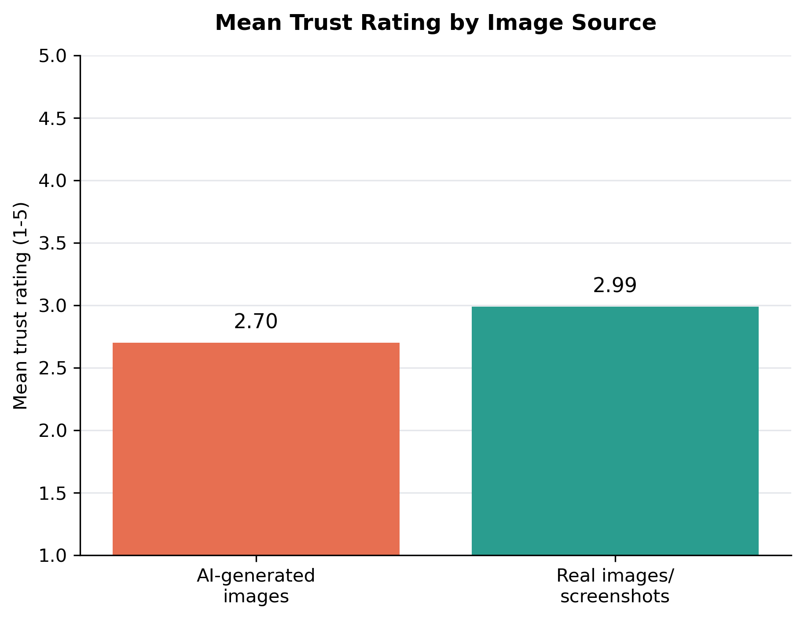
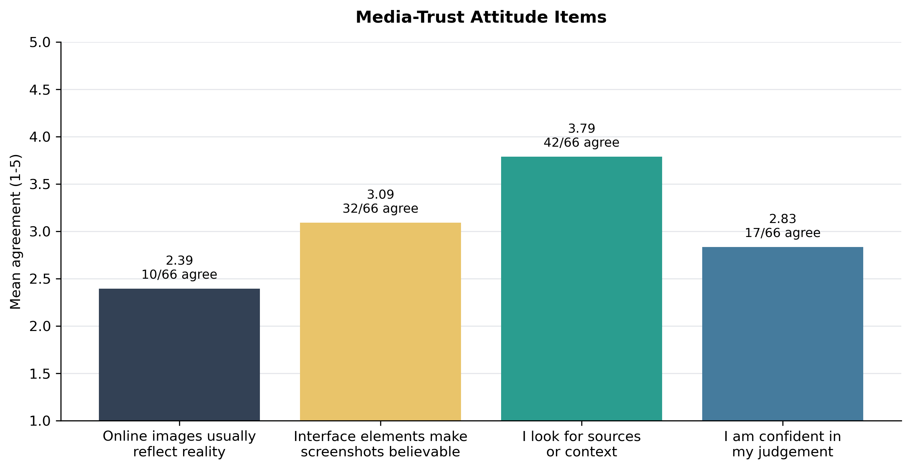

# AI-Generated Visual Content, Source Judgement, and Media Trust

Class 3, Group 6

Zheng Xing, Zhang Gaoxiang, Xiong Yubo, Wang Dexing

## Introduction

Generative AI has changed the conditions under which online images are produced and judged.
Recent image-generation models can create realistic photographs, readable text, and
interface-like screenshots. OpenAI's GPT Image 2, for example, is described as a model for
high-quality image generation and editing that can take both text and image inputs (OpenAI,
2026a). This technical development matters because online images are often treated as
evidence in everyday communication. A screenshot of a livestream, a product page, or a social
media post does not merely look like a picture. It also carries platform cues, such as
comments, usernames, prices, timestamps, and interface layout. These cues can make an image
seem like a trace of a real online event.

Previous research suggests that unaided human detection of AI-generated media is limited.
Nightingale and Farid (2022) found that AI-synthesized faces were difficult to distinguish
from real faces and could even be rated as more trustworthy. Frank et al. (2024) found that
participants in the United States, Germany, and China often struggled to classify
AI-generated and human-created media. Roca et al. (2025) also showed that image detection
performance varies across image categories. These findings indicate that visual detection is
not a single stable skill; it depends on the kind of visual material, the cues available, and
the expectations of the viewer.

The issue is also connected to media trust. Visual content can make online claims feel more
concrete, and realistic AI-synthesized images may increase belief in false information when
the images appear to support a claim (Guo et al., 2025). Screenshots are especially important
because they often function as visual evidence in online discourse (Inwood & Zappavigna,
2024). At the same time, content provenance systems such as C2PA metadata and SynthID
watermarks may help identify some AI-generated images, but they are not a complete solution
when images are cropped, compressed, reposted, or screenshotted (OpenAI, 2026b).

This report asks two research questions. First, how accurately did university-level
respondents distinguish AI-generated images from real images across selected online visual
categories? Second, how did their trust ratings differ by image source, visual category, and
material creation route? To answer these questions, the report combines previous empirical
studies with a small-scale Wenjuanxing survey conducted by our group. The local survey is
exploratory rather than representative, but it provides useful evidence about how students
judge AI-generated and real visual materials in a classroom-scale research project.

This design also reflects the scope of the course project. The report does not attempt to
prove that one image-generation model directly causes a measurable decline in public trust.
Instead, it examines a narrower and more manageable problem: when respondents face realistic
online visual materials without source labels, how stable are their judgements, and what
kinds of visual materials seem more or less trustworthy? This focus allows the survey
findings to be interpreted carefully alongside previous studies rather than overstated as a
large-scale experiment.

## Method

### Participants

Participants were recruited through convenience sampling and completed the survey online
through Wenjuanxing. A total of 79 responses were collected. Ten responses failed the Q42
attention-check item. Three attention-check passers reported "high school or below" as their
education level and were excluded because the study focused on university-level respondents.
The final analytic sample therefore included 66 valid responses.

Within the analytic sample, 26 respondents were first-year students, 14 were second-year
students, 10 were third-year students, and 16 were fourth-year-or-above students or recent
graduates. Most respondents used social media for at least one hour per day, and most had
used AI tools either daily or weekly.

### Materials

The survey used 18 image-only stimuli: nine AI-generated images and nine real images or
screenshots. The stimuli covered five visual categories: text-bearing visual artifacts,
portrait images, livestream commerce screenshots, food photographs, and virtual livestream
interfaces. These categories were selected because they represent common online visual
materials and because some of them contain platform context rather than only photographic
subjects.

The materials were selected purposively rather than randomly. Therefore, they should not be
treated as a representative sample of all online images. Instead, they were designed to
compare responses across selected forms of online visual evidence. The participant-facing
questionnaire did not reveal whether a file was AI-generated or real.

The stimulus set also used two material creation routes. In five pairs, an AI-generated image
was prepared first and a visually similar real image was later selected. In four pairs, a
real image was used as the source or reference for an AI-modified counterpart. This route
variable was analyzed descriptively because it was not randomly assigned.

The two routes were included because they reflect two common ways synthetic visual materials
may appear in practice. Some AI images are created from text prompts and then compared with
real-world examples. Others begin from existing real images and are edited, restyled, or
reconstructed through AI tools. The second route may preserve realistic composition or
platform layout from the original reference, which could make source judgement more
difficult.

### Procedure and Measures

The survey had three sections. First, participants reported their year of study, daily social
media use, AI tool use, and self-assessed ability to identify AI-generated or edited online
images. Second, participants completed the image task. For each image, they judged whether it
was real or AI-generated and then rated how trustworthy the same image would seem if it
appeared on social media or another online platform. Third, participants answered four
media-trust attitude items, one attention-check item, and one optional open-ended question
about the cues they used.

Detection accuracy was calculated as the proportion of correctly classified
source-judgement items. "Definitely real" and "probably real" were counted as correct for
real images. "Probably AI-generated" and "definitely AI-generated" were counted as correct
for AI-generated images. "Unsure" was treated as incorrect for the main accuracy score. Trust
was measured through one five-point rating for each visual item, from 1 ("not trustworthy at
all") to 5 ("very trustworthy").

## Results

### Sample and Source-Judgement Accuracy

After screening, the final analytic sample included 66 valid responses. The attention-check
pass rate was 87.3%.

**Table 1. Sample screening and final analytic sample**

| Screening step | Responses |
|---|---:|
| Submitted responses | 79 |
| Passed Q42 attention check | 69 |
| Excluded for non-university-level education | 3 |
| Final analytic sample | 66 |

Across all 18 image source-judgement items, the mean detection accuracy was 47.4%. Accuracy
was higher for AI-generated images (52.9%) than for real images or screenshots (41.9%). This
pattern suggests that respondents were not simply accepting all images as real. Many real
images were also treated with suspicion and misclassified as AI-generated.

**Table 2. Source-judgement accuracy by visual category**

| Image category | Accuracy |
|---|---:|
| Livestream commerce screenshots | 58.3% |
| Text-bearing visual artifacts | 56.8% |
| Virtual livestream interfaces | 54.5% |
| Portrait images | 39.8% |
| Food photographs | 31.1% |

Food photographs produced the lowest accuracy. This result is important because polished food
photography can look artificial even when it is real. In this sample, the spread of
AI-generated images may therefore have encouraged respondents to doubt some authentic visual
materials.

### Trust Ratings

Trust ratings were measured on a five-point scale. Real images received a slightly higher
mean trust rating (M = 2.99) than AI-generated images (M = 2.70), but the difference was
modest. By category, portrait images received the highest average trust rating (M = 3.14),
followed by text-bearing visual artifacts (M = 2.98), virtual livestream interfaces (M =
2.73), livestream commerce screenshots (M = 2.70), and food photographs (M = 2.62).

**Table 3. Mean trust ratings by image source and visual category**

| Group | Mean trust rating |
|---|---:|
| AI-generated images | 2.70 |
| Real images/screenshots | 2.99 |
| Portrait images | 3.14 |
| Text-bearing visual artifacts | 2.98 |
| Virtual livestream interfaces | 2.73 |
| Livestream commerce screenshots | 2.70 |
| Food photographs | 2.62 |

The source-level trust result shows a cautious rather than sharply divided pattern. Real
images and screenshots were rated somewhat more trustworthy than AI-generated images, but
both means remained close to the midpoint of the scale. This suggests that respondents did
not treat "real" and "AI-generated" as completely separate trust categories.

### Material Creation Route and Attitudes

Because the stimulus set used two preparation routes, an additional descriptive analysis
compared accuracy and trust by material creation route. Items from the AI-first matched-real
route had an overall accuracy of 52.4% and a mean trust rating of 2.69. Items from the
real-to-AI modification route had lower overall accuracy (41.1%) and a higher mean trust
rating (M = 3.04).

**Table 4. Accuracy and trust by material creation route**

| Material creation route | Image source | Accuracy | Mean trust rating |
|---|---|---:|---:|
| AI-first matched real | AI images | 65.2% | 2.45 |
| AI-first matched real | Real images | 39.7% | 2.92 |
| Real-to-AI modification | AI images | 37.5% | 3.01 |
| Real-to-AI modification | Real images | 44.7% | 3.07 |

The attitude items also showed cautious media trust. Respondents generally did not agree that
online images and screenshots usually reflect reality (M = 2.39). At the same time, many
respondents agreed that platform elements such as interfaces, comments, or livestream
features can make screenshots more believable. Most respondents reported verification
habits: 42 out of 66 agreed or strongly agreed that they would look for sources or context
when seeing realistic online images or screenshots. However, confidence in personal judgement
remained moderate to low (M = 2.83), with only 17 out of 66 respondents agreeing or strongly
agreeing that they were confident in judging whether online images were real.

## Discussion

The survey results suggest unstable source judgement. Overall accuracy was below 50%, and
real images were misclassified more often than AI-generated images. This finding supports the
broader literature showing that human detection of AI-generated media is unreliable (Frank et
al., 2024; Roca et al., 2025). However, the local survey also highlights a second problem:
AI-generated visual content may not only make false images easier to believe, but also make
real visual evidence easier to doubt.

The category-level pattern helps explain this result. Food photographs and portraits were
harder for respondents to classify than screenshot-like materials. One possible explanation
is that polished or staged real photos can look artificial. Respondents may therefore have
relied too heavily on surface visual cues, such as smooth texture, lighting, or composition.
This suggests that media literacy education should not only teach viewers to look for visual
flaws. It should also teach them to verify source, context, and circulation history.

The route analysis adds another qualification. AI images created through real-to-AI
modification were less accurately identified than AI images in the AI-first matched-real
route. They also received higher trust ratings. This pattern suggests that when AI generation
preserves the composition, subject matter, or platform layout of a real reference, the
resulting synthetic image may be more difficult to separate from authentic visual material.
This interpretation should remain tentative because the route variable was not experimentally
controlled.

The findings also support research on screenshots as visual evidence (Inwood & Zappavigna,
2024). Respondents tended to agree that interface elements, comments, and livestream features
can make screenshots more believable. Therefore, the risk of AI-generated visual
misinformation should not be understood only as a problem of fake photographs. It should also
be understood as a problem of fake platform context.

This point is important for media trust because many users do not evaluate online images as
isolated pictures. They also evaluate the surrounding signs of platform activity. A livestream
interface, comment stream, price label, or account name may create an impression of social
presence even if the visual material is synthetic. For this reason, future media literacy
training should include screenshot-like and interface-like materials, not only standalone
photographs.

Several limitations should be acknowledged. First, the survey used a small convenience sample
of university-level respondents, so the findings should not be generalized to all social
media users. Second, the stimulus set contained only 18 images, and differences in topic,
image quality, platform style, and visual familiarity may have influenced respondents'
judgements. Third, the material creation routes were not randomly assigned or evenly
distributed across all categories. Fourth, the original prompts used to generate the AI
images were not fully preserved, so the prompt appendix provides reconstructed documentation
rather than exact generation logs.

Despite these limitations, the report suggests that ordinary visual judgement is not enough
for evaluating online images. A more effective response requires platform-level labeling,
stronger provenance systems, verification habits, and media literacy education that addresses
both fake images and fake visual contexts.

## References

Brundage, M., Avin, S., Clark, J., Toner, H., Eckersley, P., Garfinkel, B., Dafoe, A.,
Scharre, P., Zeitzoff, T., Filar, B., Anderson, H., Roff, H., Allen, G. C., Steinhardt, J.,
Flynn, C., Héigeartaigh, S. Ó., Beard, S., Belfield, H., Farquhar, S., ... Amodei, D.
(2018). *The malicious use of artificial intelligence: Forecasting, prevention, and
mitigation.* Future of Humanity Institute. https://arxiv.org/abs/1802.07228

DiResta, R., & Goldstein, J. A. (2024). How spammers and scammers leverage AI-generated
images on Facebook for audience growth. *Harvard Kennedy School Misinformation Review.*
https://doi.org/10.37016/mr-2020-151

Frank, J., Herbert, F., Ricker, J., Schönherr, L., Eisenhofer, T., Fischer, A.,
Dürmuth, M., & Holz, T. (2024). A representative study on human detection of artificially
generated media across countries. *Proceedings of the 45th IEEE Symposium on Security and
Privacy.* https://arxiv.org/abs/2312.05976

Guo, S., Zhong, Y., & Hu, X. (2025). People are more susceptible to misinformation with
realistic AI-synthesized images that provide strong evidence to headlines. *Harvard Kennedy
School Misinformation Review.* https://doi.org/10.37016/mr-2020-189

Inwood, O., & Zappavigna, M. (2024). The legitimation of screenshots as visual evidence in
social media: YouTube videos spreading misinformation and disinformation. *Visual
Communication.* https://doi.org/10.1177/14703572241255664

Lazer, D. M. J., Baum, M. A., Benkler, Y., Berinsky, A. J., Greenhill, K. M., Menczer, F.,
Metzger, M. J., Nyhan, B., Pennycook, G., Rothschild, D., Schudson, M., Sloman, S. A.,
Sunstein, C. R., Thorson, E. A., Watts, D. J., & Zittrain, J. L. (2018). The science of fake
news. *Science, 359*(6380), 1094-1096. https://doi.org/10.1126/science.aao2998

Metzger, M. J., & Flanagin, A. J. (2013). Credibility and trust of information in online
environments: The use of cognitive heuristics. *Journal of Pragmatics, 59*, 210-220.
https://doi.org/10.1016/j.pragma.2013.07.012

Nightingale, S. J., & Farid, H. (2022). AI-synthesized faces are indistinguishable from real
faces and more trustworthy. *Proceedings of the National Academy of Sciences, 119*(8),
e2120481119. https://doi.org/10.1073/pnas.2120481119

OpenAI. (2026a). *GPT Image 2 model.* OpenAI API.
https://developers.openai.com/api/docs/models/gpt-image-2

OpenAI. (2026b). *C2PA and SynthID in OpenAI-generated images.* OpenAI Help Center.
https://help.openai.com/en/articles/8912793-c2pa-and-synthid-in-openai-generated-images

Pennycook, G., & Rand, D. G. (2021). The psychology of fake news. *Trends in Cognitive
Sciences, 25*(5), 388-402. https://doi.org/10.1016/j.tics.2021.02.007

Roca, T., Cintron Roman, A., Torres Vega, J., Duarte, M., Wang, P., White, K., Misra, A.,
& Lavista Ferres, J. (2025). How good are humans at detecting AI-generated images?
Learnings from an experiment. *arXiv preprint.* https://arxiv.org/abs/2507.18640

Vosoughi, S., Roy, D., & Aral, S. (2018). The spread of true and false news online.
*Science, 359*(6380), 1146-1151. https://doi.org/10.1126/science.aap9559

## Appendix

### Appendix A. Stimulus Pairing and Material Creation Routes

| Pair | Category | AI image | Real image | Material creation route |
|---|---|---|---|---|
| P1 | Text-bearing visual artifact | Image 1 | Image 2 | AI-first matched real |
| P2 | Text-bearing visual artifact | Image 3 | Image 4 | Real-to-AI modification |
| P3 | Portrait | Image 6 | Image 5 | AI-first matched real |
| P4 | Portrait | Image 7 | Image 8 | Real-to-AI modification |
| P5 | Livestream commerce screenshot | Image 9 | Image 10 | AI-first matched real |
| P6 | Livestream commerce screenshot | Image 11 | Image 12 | Real-to-AI modification |
| P7 | Food photo | Image 13 | Image 14 | AI-first matched real |
| P8 | Food photo | Image 15 | Image 16 | Real-to-AI modification |
| P9 | Virtual livestream interface | Image 18 | Image 17 | AI-first matched real |

### Appendix B. Reconstructed AI Image Prompts

The original prompts were not fully preserved during material preparation. The following
prompts are reconstructed from the final AI-generated stimuli and should be treated as
methodological documentation, not exact generation logs.

| AI image | Reconstructed prompt summary |
|---|---|
| Image 1 | Create a vintage postcard-style image inspired by *The Little Prince*, with a childlike figure, planet, rocket, stars, handwritten English text, stamp, and aged paper texture. |
| Image 3 | Generate an aged European postcard based on a handwritten postcard reference, preserving stamp area, postmark, address lines, and imperfect handwriting. |
| Image 6 | Create a black-and-white cinematic portrait of a young man beside a tall window with dramatic side lighting and documentary realism. |
| Image 7 | Generate a black-and-white street portrait based on a real reference, preserving profile pose, wall texture, urban setting, and strong shadows. |
| Image 9 | Create a vertical Chinese livestream shopping screenshot with a male host, food product, comments, discount labels, viewer icons, buttons, and product cards. |
| Image 11 | Generate a livestream commerce interface based on a real screenshot, with a female host, green promotional banners, Chinese discount text, product packaging, and comments. |
| Image 13 | Create a realistic restaurant ramen photograph with sliced pork, egg, green onion, seaweed, chopsticks, water glass, and warm indoor lighting. |
| Image 15 | Generate a close-up plated noodle photograph based on a real reference, preserving plate angle, glossy sauce, vegetables, and restaurant lighting. |
| Image 18 | Create a VTuber livestream interface screenshot with a blue-haired virtual streamer, blue stage design, live chat, donation counter, labels, and decorative UI overlays. |

## Contributions

| Member | Contribution |
|---|---|
| Zheng Xing | Led the overall research design, organized the project repository, drafted and revised the report, prepared the survey structure, cleaned and analyzed the data, generated the final figures, and formatted the final document. |
| Zhang Gaoxiang | Helped optimize the questionnaire and image materials, summarized the finding section, and completed one mid-term presentation of the project. |
| Xiong Yubo | Assisted with questionnaire design and prepared the final report presentation materials. |
| Wang Dexing | Contributed to questionnaire distribution and sample collection. |
