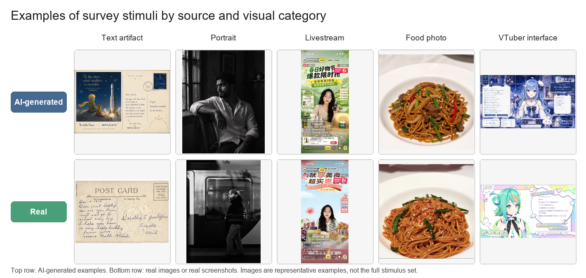
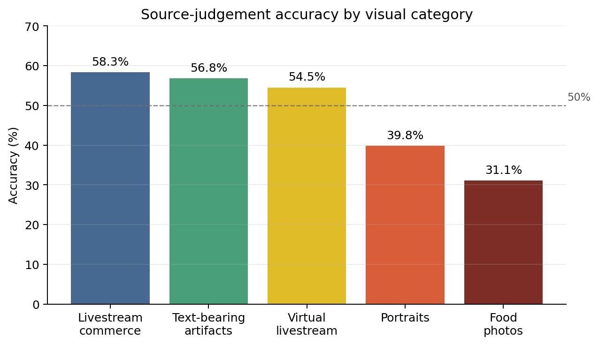
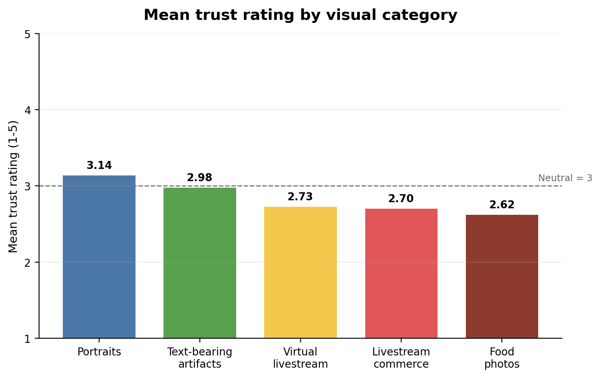
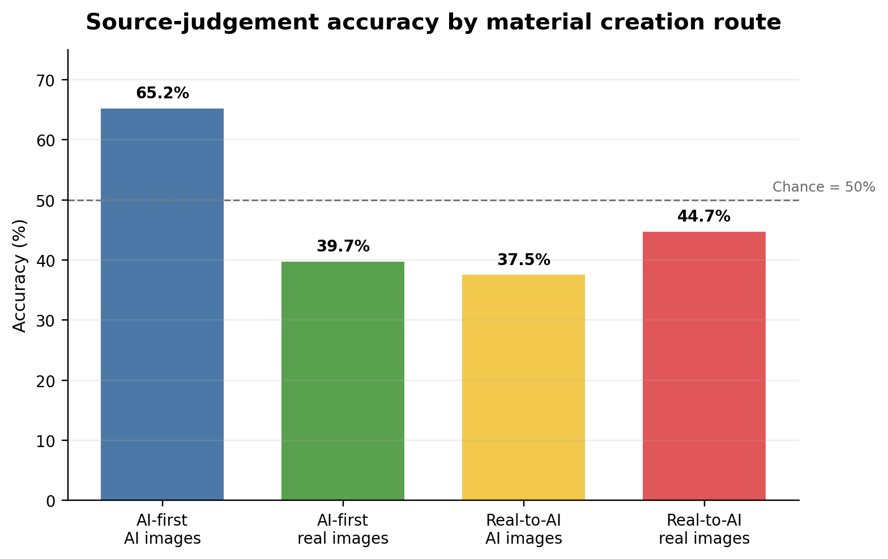

# AI-Generated Visual Content, Source Judgement, and Media Trust

Class 3, Group 6  
Zheng Xing, Zhang Gaoxiang, Xiong Yubo, Wang Dexing

## Abstract

Recent image-generation models can produce realistic photographs, readable text, and
interface-like screenshots. This development creates a practical problem for online media
trust because images and screenshots are often treated as evidence in everyday digital
communication. This paper examines how university-level respondents judged AI-generated and
real visual materials and how much they trusted different types of online images. The paper
uses a mixed evidence design: previous experimental studies provide the main research
background, while a small-scale Wenjuanxing survey supplies supplementary local evidence. The
survey included 18 image-only stimuli across five visual categories: text-bearing visual
artifacts, portraits, livestream commerce screenshots, food photographs, and virtual
livestream interfaces. The stimuli were prepared through two routes: some AI images were
generated first and then matched with similar real images, while others were created by
modifying real-image references through AI. After screening, 66 valid responses were
analyzed. The overall source-judgement accuracy was 47.4%, with higher accuracy for
AI-generated images (52.9%) than for real images or screenshots (41.9%). Route-level analysis
showed that real-to-AI modified images were especially difficult to identify. These findings
suggest that the problem is not only that users may believe AI-generated images, but also that
they may become suspicious of real visual evidence. The paper argues that platform labels,
content provenance systems, and media literacy education should address both fake images and
fake visual contexts.

**Keywords:** AI-generated images; media trust; screenshots; misinformation; visual evidence

## 1. Introduction

Generative AI is no longer limited to producing obviously artificial images. Current
image-generation tools can produce photorealistic scenes, readable text, and interface-like
layouts. OpenAI's GPT Image 2, for example, is described in official API documentation as a
state-of-the-art image generation model for high-quality generation and editing (OpenAI,
2026a). This technical development matters socially because online images are often treated
as evidence. A screenshot of a livestream, a social media post, or a chat interface does not
merely look like a picture; it appears to carry platform context, comments, prices, usernames,
and other cues of authenticity.

This paper focuses on the changing status of visual evidence in an environment where images
and screenshots are increasingly easy to generate. Previous research has shown that people
often struggle to distinguish AI-generated media from human-created or real media (Frank et
al., 2024; Roca et al., 2025). Other studies have shown that realistic AI-synthesized images
can make misinformation more persuasive when the images seem to provide evidence for a claim
(Guo et al., 2025). At the same time, screenshots occupy a special position in online
communication because they are frequently circulated as visual proof rather than as ordinary
photographs (Inwood & Zappavigna, 2024).

The central question of this paper is therefore: How accurately did university-level
respondents distinguish AI-generated images from real images across common online visual
categories, and how did their trust ratings differ by image source and category? To answer
this question, the paper combines two forms of evidence. First, it reviews previous studies
on synthetic media detection, misinformation, and visual evidence. Second, it reports a
small-scale Wenjuanxing survey conducted by the group. Because the local survey has a limited
sample size and purposively selected materials, it should be interpreted as supplementary
exploratory evidence rather than as a representative experiment. Its value is to connect
published research with a concrete classroom-scale investigation of image judgement and media
trust.

## 2. Literature Review

### 2.1 High-Fidelity AI Images and Screenshot-Like Visuals

The capacity to generate realistic synthetic media has expanded rapidly since the mid-2010s,
driven by advances in generative adversarial networks, diffusion models, and multimodal AI
systems (Brundage et al., 2018). Image-generation tools have also moved from specialist
software into everyday platforms, lowering the cost of producing convincing visual content.
Official OpenAI documentation describes GPT Image 2 as a model that supports high-quality
image generation and editing and can take text and image inputs (OpenAI, 2026a). For the
present paper, the important point is not the technical architecture of any single model, but
the broader social consequence: high-fidelity image generation makes synthetic visual content
less dependent on obvious visual errors.

AI-generated images are also no longer limited to standalone photographs. They can imitate
text-bearing and interface-bearing visuals, such as product cards, posters, livestream
screens, chat windows, and screenshot-like artifacts. These formats matter because they are
often consumed as contextual evidence. A livestream commerce screenshot, for example, may
include comments, prices, avatars, platform icons, discount labels, and a host. Such details
can make viewers feel that they are seeing a trace of a real online event rather than a
constructed image. As a result, the social risk of AI image generation includes both fake
photographs and fake visual contexts.

### 2.2 Human Ability to Detect AI-Generated Images

A growing body of empirical research suggests that unaided human detection of AI-generated
content is limited. Nightingale and Farid (2022) found that AI-synthesized faces were
difficult to distinguish from real faces and were even rated as more trustworthy. This finding
is important because it challenges the assumption that realism and trustworthiness are reliable
signals of authenticity.

Frank et al. (2024) conducted a cross-national study with participants from the United States,
Germany, and China. Participants were exposed to AI-generated and human-created media across
text, image, and audio modalities and asked to classify each item. The study found that many
participants performed close to chance level, and demographic or media-literacy variables did
not reliably guarantee accurate detection. In the image domain specifically, Roca et al.
(2025) analyzed a large online detection experiment and found that human performance varied
across visual categories. These findings indicate that image detection should not be treated
as a single uniform ability. Instead, performance may depend on the type of image, the
viewer’s expectations, and the cues available in the visual material.

### 2.3 Screenshots, Visual Evidence, and Media Trust

Research on misinformation and online credibility helps explain why AI-generated visual
content can affect trust. False and misleading information can spread widely online (Lazer et
al., 2018; Vosoughi et al., 2018), and users often rely on fast credibility cues rather than
systematic verification (Metzger & Flanagin, 2013; Pennycook & Rand, 2021). Visual cues are
especially powerful because they can make an online claim feel concrete.

Screenshots are a particularly important form of visual evidence. Inwood and Zappavigna
(2024) argue that screenshots often legitimize online claims because they appear to preserve
a record of a platform event. The screenshot format can make a post, message, or livestream
look traceable and shareable. This helps explain why AI-generated screenshots may be
persuasive even when viewers are generally aware that synthetic media exists.

The problem also extends to misinformation. Guo et al. (2025) found that realistic
AI-synthesized images increased belief in false headlines when the images appeared to provide
strong evidence for the claim. DiResta and Goldstein (2024) documented the use of
AI-generated images by spammers and scammers on Facebook for audience growth. These studies
suggest that synthetic visual content is not only a future risk but already part of platform
communication.

Content provenance and labeling systems are relevant responses, but they are incomplete on
their own. OpenAI's current help documentation describes the use of C2PA metadata and SynthID
watermarks in OpenAI-generated images (OpenAI, 2026b). Such systems may help users identify
AI-generated content, but ordinary users often encounter images after reposting, cropping,
compression, screenshotting, or platform re-uploading. Therefore, technical provenance should
be combined with user education and platform-level moderation rather than treated as a
complete solution.

## 3. Methodology

### 3.1 Research Design

This paper uses a mixed evidence design. Previous empirical studies provide the main
background for understanding human detection limits and the social effects of synthetic
visual media. The group survey provides supplementary local evidence about how a
university-level sample judged AI-generated and real online images. This design is
appropriate because the local survey is small and exploratory, while the published studies
offer broader evidence from larger samples and more controlled experiments.

The local survey focused on two connected questions. First, how accurately did respondents in
this sample distinguish AI-generated images from real images across selected online visual
categories? Second, how did perceived trust differ by image source and visual category?

### 3.2 Participants

Participants were recruited through convenience sampling and completed the survey online
through Wenjuanxing. A total of 79 responses were collected. Ten responses failed the Q42
attention-check item, and three attention-check passers reported "high school or below" as
their current education level. These responses were excluded from the main analysis so that
the analytic sample matched the study's university-level focus. The final analytic sample
therefore included 66 valid respondents.

Within the analytic sample, 26 respondents were first-year students, 14 were second-year
students, 10 were third-year students, and 16 were fourth-year-or-above students or recent
graduates. Most respondents used social media for at least one hour per day, and most had
used AI tools either daily or weekly.

### 3.3 Materials

The survey used image-only materials. It contained 18 visual items: nine AI-generated images
and nine real images or screenshots. The materials covered five visual categories:
text-bearing visual artifacts, portrait images, livestream commerce screenshots, food
photographs, and virtual livestream interfaces. These categories were selected because they
represent common forms of online visual content and because some of them contain platform
contexts rather than only photographic subjects.

The materials were selected purposively rather than randomly. Therefore, they should not be
treated as a statistically representative sample of all online images. Instead, they were
designed to compare responses across selected types of online visual evidence. The
participant-facing questionnaire did not reveal whether a file was AI-generated or real.

The stimulus set was also prepared through two material creation routes. In five pairs, an
AI-generated image was prepared first and a visually similar real image was later selected for
comparison. In four pairs, a real image was used as the source or reference for an
AI-modified counterpart. This route variable was added after the main category analysis in
order to examine whether the production route of the stimulus was related to source judgement
and trust ratings. The route variable should be interpreted descriptively because it was not
randomly assigned and was partly connected with the available image categories. The full
stimulus pairing, route labels, and reconstructed generation prompts are provided in the
appendices.

### 3.4 Procedure

The survey had three sections. First, participants reported their year of study, daily social
media use, AI tool use, and self-assessed ability to identify AI-generated or edited online
images. Second, participants completed the image task. For each image, they first judged
whether the image was real or AI-generated and then rated how trustworthy the same image would
seem if it appeared on social media or another online platform. Third, participants answered
four media-trust attitude items, one attention-check item, and one optional open-ended
question about the cues they used.

No feedback was given during the task so that later answers would not be influenced by
earlier corrections. Because the study compared responses across visual categories, the
Wenjuanxing version grouped materials of the same type together. During analysis, responses
that failed the attention-check item were excluded before detection accuracy and trust scores
were calculated.

### 3.5 Measures

Detection accuracy was calculated as the proportion of correctly classified source-judgement
items. For binary accuracy scoring, "definitely real" and "probably real" were counted as
correct for real images, while "probably AI-generated" and "definitely AI-generated" were
counted as correct for AI-generated images. "Unsure" was treated as incorrect for the main
accuracy score.

Trust was measured through one five-point rating for each visual item, from 1 ("not
trustworthy at all") to 5 ("very trustworthy"). Mean trust ratings were calculated by image
source, visual category, and material creation route. Additional attitude items measured
general trust in online images and screenshots, the perceived credibility effect of interface
elements, verification habits, and self-confidence in visual judgement.

## 4. Results

### 4.1 Survey Sample

The Wenjuanxing survey collected 79 responses. Of these, 69 responses passed the Q42
attention-check item, giving an attention-check pass rate of 87.3%. After excluding three
attention-check passers who were outside the university-level target group, the final
analytic sample included 66 valid responses.

**Table 1. Sample screening and final analytic sample**

| Screening step | Responses |
|---|---:|
| Submitted responses | 79 |
| Passed Q42 attention check | 69 |
| Excluded for non-university-level education | 3 |
| Final analytic sample | 66 |

### 4.2 Source-Judgement Accuracy

Across all 18 image source-judgement items, the mean detection accuracy was 47.4%. Accuracy
was higher for AI-generated images (52.9%) than for real images or screenshots (41.9%). This
pattern indicates that respondents did not simply accept all images as real. Instead, many
real images were also treated with suspicion and misclassified as AI-generated.

**Table 2. Source-judgement accuracy by visual category**

| Image category | Accuracy |
|---|---:|
| Livestream commerce screenshots | 58.3% |
| Text-bearing visual artifacts | 56.8% |
| Virtual livestream interfaces | 54.5% |
| Portrait images | 39.8% |
| Food photographs | 31.1% |

### 4.3 Trust Ratings and Attitudes

Trust ratings were measured on a five-point scale from 1 ("not trustworthy at all") to 5
("very trustworthy"). Real images received a slightly higher mean trust rating (M = 2.99)
than AI-generated images (M = 2.70), but the difference was modest. By category, portrait
images received the highest average trust rating (M = 3.14), followed by text-bearing visual
artifacts (M = 2.98), virtual livestream interfaces (M = 2.73), livestream commerce
screenshots (M = 2.70), and food photographs (M = 2.62).

**Table 3. Mean trust ratings by image source and visual category**

| Group | Mean trust rating |
|---|---:|
| AI-generated images | 2.70 |
| Real images/screenshots | 2.99 |
| Portrait images | 3.14 |
| Text-bearing visual artifacts | 2.98 |
| Virtual livestream interfaces | 2.73 |
| Livestream commerce screenshots | 2.70 |
| Food photographs | 2.62 |

### 4.4 Material Creation Route Analysis

Because the stimulus set used two preparation routes, an additional descriptive analysis
compared accuracy and trust by material creation route. Items from the AI-first matched-real
route had an overall accuracy of 52.4% and a mean trust rating of 2.69. Items from the
real-to-AI modification route had lower overall accuracy (41.1%) and a higher mean trust
rating (M = 3.04).

The route-by-source pattern was especially important. AI images in the AI-first matched-real
route were identified relatively accurately (65.2%), while real images in the same route were
often misclassified (39.7%). In contrast, AI images created through real-to-AI modification
had the lowest accuracy (37.5%) and a higher mean trust rating (M = 3.01). This descriptive
pattern suggests that AI images based on real-image references may be harder for respondents
to identify than AI images generated independently and then paired with similar real images.

**Table 4. Accuracy and trust by material creation route**

| Material creation route | Image source | Accuracy | Mean trust rating |
|---|---|---:|---:|
| AI-first matched real | AI images | 65.2% | 2.45 |
| AI-first matched real | Real images | 39.7% | 2.92 |
| Real-to-AI modification | AI images | 37.5% | 3.01 |
| Real-to-AI modification | Real images | 44.7% | 3.07 |

The attitude items showed a cautious pattern of media trust. Respondents generally did not
agree that online images and screenshots usually reflect reality (M = 2.39). At the same
time, many respondents agreed that platform elements such as interfaces, comments, or
livestream features can make screenshots more believable. Most respondents also reported
verification habits: 42 out of 66 agreed or strongly agreed that they would look for sources
or context when seeing realistic online images or screenshots.

## 5. Discussion

### 5.1 Summary of Findings

The local survey results are consistent with the broader literature on AI-generated media
detection. The overall accuracy rate was below 50%, suggesting that respondents in this
sample had difficulty distinguishing AI-generated images from real images. The source-level
pattern is also important: respondents performed better on AI-generated images than on real
images. This indicates that the problem was not only false acceptance of synthetic material,
but also excessive suspicion toward authentic visual material.

Category-level results further support this interpretation. Livestream commerce screenshots,
text-bearing artifacts, and virtual livestream interfaces produced higher accuracy than
portraits and food photographs. Food photographs had the lowest accuracy, which may reflect
the fact that polished food photography can look artificial even when it is real. Trust
ratings were moderate rather than high, and the difference between real and AI-generated
images was relatively small. This suggests that viewers may experience uncertainty even when
they do not strongly trust the images.

The material creation route analysis adds a further qualification. AI images created through
real-to-AI modification were less accurately identified than AI images in the AI-first
matched-real route. They also received higher trust ratings. This suggests that when AI
generation preserves the composition, subject matter, or visual realism of a real reference,
the resulting synthetic image may be more difficult to separate from authentic visual
material.

### 5.2 Comparison with Previous Studies

The findings align with previous studies showing that human detection of AI-generated media
is limited. Frank et al. (2024) found that many participants performed close to chance level
across different media types. Roca et al. (2025) also showed that image detection performance
varied by content type. The current survey is much smaller, but its descriptive results point
in the same direction: general familiarity with AI tools does not automatically produce
reliable detection ability.

The results also connect with research on misinformation and visual evidence. Guo et al.
(2025) found that realistic AI-synthesized images can strengthen belief in misinformation
when they appear to support a claim. In the present survey, AI-generated images did not
receive high trust ratings overall, but they were sometimes trusted at levels close to real
images. This matters because even moderate trust may be enough to make an online claim appear
more credible.

Finally, the findings support Inwood and Zappavigna's (2024) argument that screenshots often
function as visual evidence. Respondents tended to agree that platform elements such as
interfaces, comments, and livestream features can make screenshots more believable. Therefore,
the risk of AI-generated visual misinformation should not be understood only as a problem of
fake photographs. It should also be understood as a problem of fake platform context.

### 5.3 Possible Explanations

One possible explanation for the low overall accuracy is that respondents relied heavily on
surface visual cues. Some real food photographs and portraits looked polished, staged, or
digitally processed. Respondents may therefore have classified them as AI-generated. This
helps explain why real images had lower accuracy than AI-generated images. The increasing
presence of synthetic images may lead users not only to believe some false images but also to
doubt real ones.

A second explanation is related to the survey materials. The images were selected
purposively, not randomly. The set was designed to compare responses across selected visual
categories, including ordinary photographs and screenshot-like images. This design made it
possible to compare category-level patterns, but it also limits generalization. The results
should therefore be treated as descriptive evidence from a small exploratory survey.

A third explanation concerns material creation route. In the AI-first matched-real route, the
AI images may have retained more visible synthetic features, which could explain why they were
identified more accurately. In the real-to-AI modification route, however, the AI image was
based on a real reference. This may have preserved natural composition, lighting, or platform
layout, making the AI-modified image more believable. This interpretation remains tentative
because the route variable was not experimentally controlled.

A fourth explanation concerns visual context. Screenshot-like materials contain contextual
cues, such as usernames, comments, platform layout, product labels, prices, or livestream
interfaces. These cues can make an image feel less like a standalone picture and more like a
record of an online event. Even when viewers are uncertain about the source of an image, such
contextual cues may increase the image's perceived credibility.

### 5.4 Limitations and Implications

Several limitations should be acknowledged. First, the survey used a small convenience sample
of university-level respondents, so the findings should not be generalized to all social
media users. Second, the stimulus set contained only 18 images, and differences in topic,
image quality, platform style, and visual familiarity may have influenced respondents'
judgements. Third, the two material creation routes were not randomly assigned or evenly
distributed across all categories, so the route analysis should be interpreted as exploratory.
Fourth, the original prompts used to generate the AI images were not fully preserved. The
prompt appendix therefore provides reconstructed documentation rather than an exact record of
the original generation process. Finally, because the study used descriptive statistics, it
cannot establish causal relationships between image type, trust, production route, and source
judgement.

Despite these limitations, the findings have practical implications. Platforms and educators
should not assume that users can reliably identify AI-generated images through visual
inspection alone. Media literacy education should teach users to verify sources and contexts,
not merely to search for visual flaws. Platform labels, content provenance systems, and
watermarking may also help, but they should be treated as part of a broader response rather
than as a complete solution. As images move across platforms, are compressed, edited, or
screenshotted, the reliability of provenance signals may vary.

## 6. Conclusion

This paper examined AI-generated visual content, source judgement, and media trust through a
combination of previous research and a small-scale local survey. The survey results suggest
that university-level respondents did not reliably distinguish AI-generated images from real
images. The overall accuracy rate was 47.4%, and real images were misclassified more often
than AI-generated images. Trust ratings were also moderate, with only a small difference
between real and AI-generated images.

The main implication is that the social risk of AI-generated visual content is broader than
the production of false images. As synthetic images become more realistic, real visual
evidence may also become easier to doubt. The route analysis further suggests that
AI-modified versions of real-image references may be especially difficult to identify because
they can inherit realistic composition and contextual cues from the source material. This is
especially important for screenshot-like materials, which often carry platform cues that make
them appear socially credible. Ordinary visual judgement is therefore insufficient for
evaluating online images. A more effective response requires platform-level labeling,
stronger provenance systems, verification habits, and media literacy education that addresses
both fake images and fake visual contexts.

## References

Brundage, M., Avin, S., Clark, J., Toner, H., Eckersley, P., Garfinkel, B., Dafoe, A.,
Scharre, P., Zeitzoff, T., Filar, B., Anderson, H., Roff, H., Allen, G. C., Steinhardt, J.,
Flynn, C., Héigeartaigh, S. Ó., Beard, S., Belfield, H., Farquhar, S., ... Amodei, D.
(2018). *The malicious use of artificial intelligence: Forecasting, prevention, and
mitigation.* Future of Humanity Institute. https://arxiv.org/abs/1802.07228

DiResta, R., & Goldstein, J. A. (2024). How spammers and scammers leverage AI-generated
images on Facebook for audience growth. *Harvard Kennedy School Misinformation Review.*
https://doi.org/10.37016/mr-2020-151

Frank, J., Herbert, F., Ricker, J., Schönherr, L., Eisenhofer, T., Fischer, A.,
Dürmuth, M., & Holz, T. (2024). A representative study on human detection of artificially
generated media across countries. *Proceedings of the 45th IEEE Symposium on Security and
Privacy.* https://arxiv.org/abs/2312.05976

Guo, S., Zhong, Y., & Hu, X. (2025). People are more susceptible to misinformation with
realistic AI-synthesized images that provide strong evidence to headlines. *Harvard Kennedy
School Misinformation Review.* https://doi.org/10.37016/mr-2020-189

Inwood, O., & Zappavigna, M. (2024). The legitimation of screenshots as visual evidence in
social media: YouTube videos spreading misinformation and disinformation. *Visual
Communication.* https://doi.org/10.1177/14703572241255664

Lazer, D. M. J., Baum, M. A., Benkler, Y., Berinsky, A. J., Greenhill, K. M., Menczer, F.,
Metzger, M. J., Nyhan, B., Pennycook, G., Rothschild, D., Schudson, M., Sloman, S. A.,
Sunstein, C. R., Thorson, E. A., Watts, D. J., & Zittrain, J. L. (2018). The science of fake
news. *Science, 359*(6380), 1094-1096. https://doi.org/10.1126/science.aao2998

Metzger, M. J., & Flanagin, A. J. (2013). Credibility and trust of information in online
environments: The use of cognitive heuristics. *Journal of Pragmatics, 59*, 210-220.
https://doi.org/10.1016/j.pragma.2013.07.012

Nightingale, S. J., & Farid, H. (2022). AI-synthesized faces are indistinguishable from real
faces and more trustworthy. *Proceedings of the National Academy of Sciences, 119*(8),
e2120481119. https://doi.org/10.1073/pnas.2120481119

OpenAI. (2026a). *GPT Image 2 model.* OpenAI API.
https://developers.openai.com/api/docs/models/gpt-image-2

OpenAI. (2026b). *C2PA and SynthID in OpenAI-generated images.* OpenAI Help Center.
https://help.openai.com/en/articles/8912793-c2pa-and-synthid-in-openai-generated-images

Pennycook, G., & Rand, D. G. (2021). The psychology of fake news. *Trends in Cognitive
Sciences, 25*(5), 388-402. https://doi.org/10.1016/j.tics.2021.02.007

Roca, T., Cintron Roman, A., Torres Vega, J., Duarte, M., Wang, P., White, K., Misra, A.,
& Lavista Ferres, J. (2025). How good are humans at detecting AI-generated images?
Learnings from an experiment. *arXiv preprint.* https://arxiv.org/abs/2507.18640

Vaccari, C., & Chadwick, A. (2020). Deepfakes and disinformation: Exploring the impact of
synthetic political video on deception, uncertainty, and trust in news. *Social Media +
Society, 6*(1). https://doi.org/10.1177/2056305120903408

Vosoughi, S., Roy, D., & Aral, S. (2018). The spread of true and false news online.
*Science, 359*(6380), 1146-1151. https://doi.org/10.1126/science.aap9559

## Appendix A. Stimulus Pairing and Material Creation Routes

The survey stimuli were organized into nine AI/real pairs. The pairings were used to compare
AI-generated and real visual materials within similar online visual categories. The route
labels document how the materials were prepared for the survey.

| Pair | Category | AI image | Real image | Material creation route |
|---|---|---|---|---|
| P1 | Text-bearing visual artifact | Image 1 | Image 2 | AI-first matched real |
| P2 | Text-bearing visual artifact | Image 3 | Image 4 | Real-to-AI modification |
| P3 | Portrait | Image 6 | Image 5 | AI-first matched real |
| P4 | Portrait | Image 7 | Image 8 | Real-to-AI modification |
| P5 | Livestream commerce screenshot | Image 9 | Image 10 | AI-first matched real |
| P6 | Livestream commerce screenshot | Image 11 | Image 12 | Real-to-AI modification |
| P7 | Food photo | Image 13 | Image 14 | AI-first matched real |
| P8 | Food photo | Image 15 | Image 16 | Real-to-AI modification |
| P9 | Virtual livestream interface | Image 18 | Image 17 | AI-first matched real |

In the AI-first matched-real route, an AI-generated image was prepared first, and a visually
similar real image was later selected for comparison. In the real-to-AI modification route, a
real image was used as the source or reference for an AI-modified counterpart. The full file
paths, question numbers, labels, and route notes are recorded in `Experiment/Materials_Manifest.csv`.

## Appendix B. Reconstructed AI Image Prompts

The original prompts were not fully preserved during early material preparation. The prompts
below are therefore reconstructed from the final AI-generated stimuli and the documented
material workflow. They should be treated as methodological documentation, not as exact
generation logs.

**Image 1, P1, text-bearing visual artifact, AI-first matched real.**
Create a realistic vintage postcard-style image inspired by *The Little Prince*, with a
small childlike figure sitting on a planet under a dark blue starry sky, a tall white rocket,
a moon, and a split postcard layout with handwritten English text, postage stamp, and
postmark. Make it look like a photographed paper artifact, with aged texture and imperfect
typography.

**Image 3, P2, text-bearing visual artifact, real-to-AI modification.**
Using an old handwritten postcard as the visual reference, generate a similar aged European
postcard on cream paper. Preserve the postcard layout, stamp area, postmark, address lines,
and handwritten message, but make the text and paper texture look naturally imperfect rather
than digitally clean.

**Image 6, P3, portrait, AI-first matched real.**
Create a black-and-white cinematic portrait photograph of a young adult man sitting indoors
beside a tall window. Use dramatic side lighting, deep shadows, realistic facial detail, a
white shirt, and a quiet documentary photography style.

**Image 7, P4, portrait, real-to-AI modification.**
Using a black-and-white street portrait as a reference, generate a similar documentary-style
image of a middle-aged man walking in profile beside a textured wall. Preserve the high
contrast, dark clothing, urban setting, and strong shadow structure.

**Image 9, P5, livestream commerce screenshot, AI-first matched real.**
Create a vertical mobile livestream shopping screenshot in a Chinese e-commerce app. Show a
male host wearing glasses and holding a food product, with dense interface overlays, comment
bubbles, discount labels, viewer icons, hearts, buttons, and product cards. Make the image
look like a real livestream commerce screen capture.

**Image 11, P6, livestream commerce screenshot, real-to-AI modification.**
Using a real livestream commerce screenshot as a reference, generate a similar vertical
mobile shopping interface. Show a young female host, green promotional banners, Chinese
discount text, product packaging, comment overlays, purchase buttons, and a busy platform
layout.

**Image 13, P7, food photo, AI-first matched real.**
Create a realistic restaurant food photograph of a bowl of Japanese ramen on a wooden
counter. Include sliced pork, soft-boiled eggs, green onions, seaweed, chopsticks, a water
glass, and warm indoor lighting. Use shallow depth of field and smartphone food photography
realism.

**Image 15, P8, food photo, real-to-AI modification.**
Using a real plated noodle photograph as a reference, generate a similar close-up food photo
of stir-fried noodles on a white plate. Preserve the plate angle, glossy sauce, vegetables,
and restaurant lighting while making the image appear like a natural food photograph.

**Image 18, P9, virtual livestream interface, AI-first matched real.**
Create a wide VTuber livestream interface screenshot with a blue-haired anime-style virtual
streamer in the center, blue starry stage design, live chat panels, donation or viewer
counters, stream labels, and decorative UI overlays. Make it look like a real virtual
livestream screen capture rather than a standalone illustration.

## Appendix C. Supplementary Route-Level Results

The following descriptive tables use the same 66 valid responses as the main analysis.

| Material creation route | Items | Accuracy | Mean trust rating |
|---|---:|---:|---:|
| AI-first matched real | 660 | 52.4% | 2.69 |
| Real-to-AI modification | 528 | 41.1% | 3.04 |

| Material creation route | Image source | Items | Accuracy | Mean trust rating |
|---|---|---:|---:|---:|
| AI-first matched real | AI images | 330 | 65.2% | 2.45 |
| AI-first matched real | Real images | 330 | 39.7% | 2.92 |
| Real-to-AI modification | AI images | 264 | 37.5% | 3.01 |
| Real-to-AI modification | Real images | 264 | 44.7% | 3.07 |
